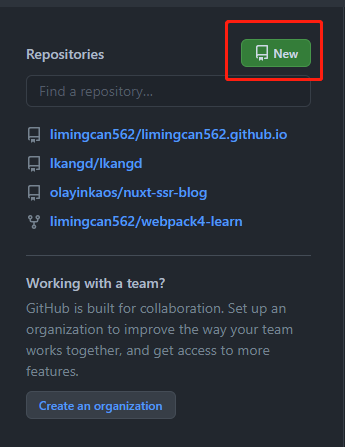
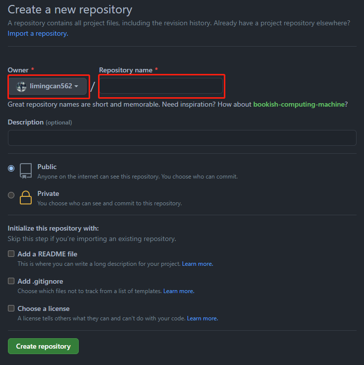

# 如何使用nuxtJs在github.io搭建自己博客
> 可以使用 nuxtJS DIY 一个专属自己的博客，利用 `markdown` 来记录博客

## 概述  
1. 设置 `github` 上的个人主页
2. 在本地构建项目
3. 踩坑

### 设置 `github` 上的个人主页
1.新建一个项目
登录以后，点击主页的 `New` 按钮

2.设置未来 `github.io` 主页的链接

**注意：**
- `Repository name` 请填写前面的 `Owner` 名字 + `.github.io`
- 如图示，`Repository name` 就应该写 `limingcan562.github.io` 这样后面可以直接用 `limingcan562.github.io` 打开你的个人主页

3.进入右上角 --> 打开设置（注册步骤请自行解决）

